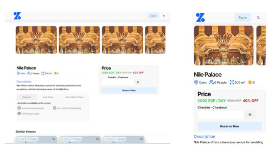
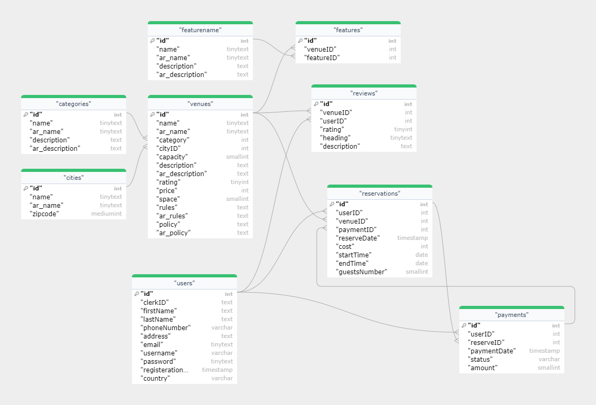
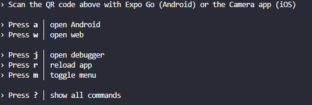
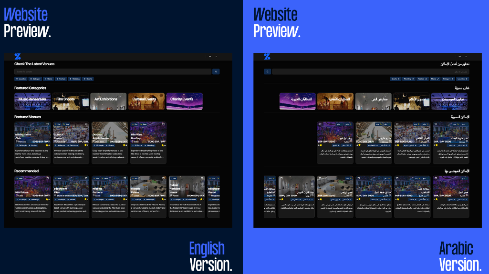
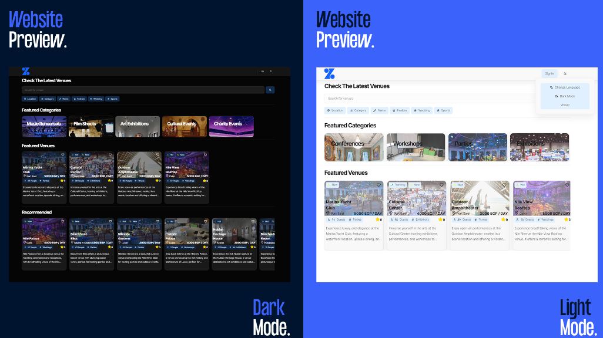

<h1 align="center">
  Zabatly
</h1>
<p align="center">
</p>
<h4 align="center">An online marketplace platform to gather users, event organizers and venue owners to effortlessly search, view and reserve venues.</h4>
<p align="center">
<a href="https://github.com/Zabatly/website/blob/main/LICENSE">
   
</a>
</p>

## Table of Contents

- [Objective](#objective)
- [Features](#features)
- [Prerequisites](#prerequisites)
- [Installation](#installation)
- [Technology Stack and Project Structure](#technology-stack-and-project-structure)
- [Wishlist](#wishlist)
- [Contributors](#contributors)
- [Credits](#credits)
- [Showcase](#showcase)
- [FAQ](#faq)

## Objective

This project has driven us into an exciting journey through the development, implementation and the evaluation of an universal application for venue reservation system. Our goal was to create an online marketplace platform to gather users, event organizers and venue owners to effortlessly search, view and reserve venue. With the support of the cutting-edge web and mobile technologies, we aimed to facilitate the venue reservation process and make it accessible for anyone whom want to reserve a venue anytime and from any part of the world. For more information about our analysis of the project please click [here](https://tahahesham.com/zabatly-app)

## Features

- Universal application that works multi-platform based on the popular [CUA](https://github.com/chen-rn/CUA) template which tries to adapt the [T3 Stack](https://create.t3.gg/).
- 9+ Shared screen codebase that runs on all platforms.
- Localization system powered i18n that supports both EN/AR languages
- AI support [chatbot](https://github.com/Zabatly/AI) widget that helps your through the process (Supports EN/AR languages).
- AI [recommendation](https://github.com/Zabatly/AI) system that helps recommend your next venue reservation.
- User accounts system based on the popular universal authentication library [Clerk](https://clerk.com/?utm_campaign=theo-dtc)
- Customizable Search experience to find venues based on your preference.
- Ability to reserve any venue based on your preferred time.
- Fully normalized & optimized database design that can help handle huge data.

## Prerequisites

- Latest [Node.js LTS](https://nodejs.org/en/download)
- Setting up React Native development [environment](https://reactnative.dev/docs/environment-setup)
- [Clerk](https://clerk.com/docs/quickstarts/setup-clerk) account for the environment keys.
- (optional) [Planetscale](https://planetscale.com/docs/tutorials/planetscale-quick-start-guide) account if you need to deploy the application.
- (optional) [Vercel](https://vercel.com/docs/getting-started-with-vercel) account if you need to deploy the application.

## Installation

```bash
# Clone repo
git clone https://github.com/Zabatly/website.git

# Install the required packages
## Using NPM
npm install

## Using yarn (preferred)
yarn install
```

### Configuration

- You can edit `.env.example` add the [Clerk](https://clerk.com/docs/quickstarts/setup-clerk) API keys in their respective places:

```env
NEXT_PUBLIC_CLERK_PUBLISHABLE_KEY=pk_test_
CLERK_SECRET_KEY=sk_test_
```

- Edit the `DATABASE_URL` field to add your own database connection. If you are planning to use a specific database type other than MySQL, then please make sure to edit [schema.prisma](https://github.com/Zabatly/website/blob/main/packages/db/prisma/schema.prisma) in [`provider`](https://www.prisma.io/docs/reference/api-reference/prisma-schema-reference#fields) field.

  - Database schema design is available in [`zabatly.sql`](https://github.com/Zabatly/website/blob/main/packages/db/zabatly.sql) with dummy data. Its already synced with the current `schema.prisma`. You can use prisma to [push](https://www.prisma.io/docs/reference/api-reference/command-reference#db-push) the schema directly to your database, so it can create the appropiate tables. Incase you want to do it manually by importing the `zabatly.sql` first, then you can use in prisma [introspection](https://www.prisma.io/docs/getting-started/setup-prisma/add-to-existing-project/relational-databases/introspection-typescript-sqlserver#introspect-your-database-with-prisma) to synchronize your `schema.prisma` with your database design.

  - Here is the complete database design in Entity Relation Diagram Form:
    

- After configuring the database, you'll need to generate [Prisma Client](https://www.prisma.io/docs/reference/api-reference/command-reference#generate)

```bash
# Using NPM
npm run generate

# Using Yarn
yarn generate
```

- You can add / edit data on your database using [Prisma Studio](https://www.prisma.io/studio)

```bash
# Using NPM
npm run studio

# Using Yarn
yarn studio

# Usually Should run on localhost:5555
```

### Running the Project (Development mode)

- You can start by running the web version of the application. It is essential to access the web version of the application and also act as an server for the native (mobile) version of the application

```bash
# Using NPM
npm run web

# Using Yarn
yarn web

# Usually Should run on localhost:3000
```

- You can also now run the native (mobile) version of the application. You'll need [Expo Go](https://expo.dev/client) application on your phone in-order to check your application.

```bash
# Using NPM
npm run native

# Using Yarn
yarn native

# Should open an Expo menu to launch the application on IOS/Android
```



- Last step is to setup the [Zabatly AI](https://github.com/Zabatly/AI) which would be needed for the chatbot & the recommendation system

## Technology stack and Project structure

To know more about it, you can check the CUA template's [explanation](https://github.com/chen-rn/CUA#-how-it-works)

## Wishlist

- [ ] Update the project to use the all new [T4 Stack](https://github.com/timothymiller/t4-app/tree/main#--create-t4-app)
- [ ] Enhance the interface further in terms of design
- [ ] Payment API support such as [Stripe](https://stripe.com/docs)
- [ ] Ability to host venues.
- [ ] Reviews for venues and hosts

## Contributors

Special thanks to the team for the help across the board

- [Youssef Elmarakshy](https://github.com/Carbowix)
- [Taha Hesham](https://github.com/tahahesham)
- [Mostafa Awara](https://github.com/mostafavic)
- [Mohammed Effat](https://github.com/bondo2boy)

## Credits

- [Create universal Application (CUA)](https://github.com/chen-rn/CUA) for the amazing template
- [Tamagui](https://tamagui.dev/) for the incredible dynamic cross-platform UI
- [T3 Stack](https://create.t3.gg/) which includes an amazing technology stack that helped form this project
- [Solito](https://github.com/nandorojo/solito) which made cross platform totally possible due to the navigation unification of both platforms (web + native)

## Showcase




## FAQ

1. **Where should I install the packages?**
   If it contains native code you must install it into the `/expo` folder.

2. **How do I know if it contains native code?**
   In general if it involves some interactions with the phone OS like the APIs to interact with storage, camera, gyro, notification, etc. it involves native code!
